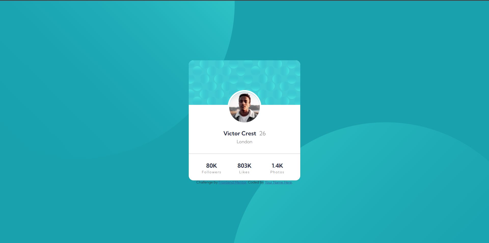
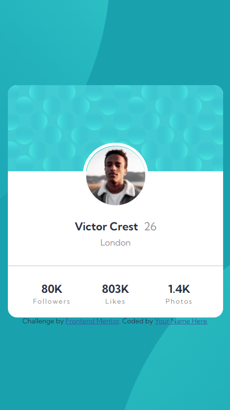

# Frontend Mentor - Profile card component solution

This is a solution to the [Profile card component challenge on Frontend Mentor](https://www.frontendmentor.io/challenges/profile-card-component-cfArpWshJ). Frontend Mentor challenges help you improve your coding skills by building realistic projects.

## Table of contents

- [Overview](#overview)
  - [The challenge](#the-challenge)
  - [Screenshot](#screenshot)
  - [Links](#links)
- [My process](#my-process)
  - [Built with](#built-with)
  - [What I learned](#what-i-learned)
  - [Continued development](#continued-development)
  - [Useful resources](#useful-resources)
- [Author](#author)
- [Acknowledgments](#acknowledgments)


## Overview

### The challenge

- Build out the project to the designs provided

### Screenshot




### Links

- Solution URL: [https://github.com/why-not-phoenix/profile-card-component-main-.git](https://github.com/why-not-phoenix/profile-card-component-main-.git)
- Live Site URL: [https://why-not-phoenix.github.io/profile-card-component-main-/](https://why-not-phoenix.github.io/profile-card-component-main-/)

## My process

### Built with

- Semantic HTML5 markup
- CSS custom properties
- Flexbox
- CSS Grid

### What I learned

- Learned a nice way to position background based on viewport to make it responsive.

```css
body {
  background-position: right 52vw bottom 35vh, left 47vw top 50vh;
}
```

### Continued development

- Generally need to work on my decision making and ways I can go about solving things. Particularly had an issue trying to make the profile picture responsive because I made it positioned absolute when all I really needed to do was give it a negative margin.

### Useful resources

- [Converting Colors](https://convertingcolors.com/) - This helped me to easily convert hgb to hexcode. Used it to get a more websafe color format.
- [Color About](https://www.colorabout.com/) - This is just another site I used that helped with same thing.

## Author

- Website - [Dominion Onoja](https://why-not-phoenix.github.io/cv/) - Very temporary site
- Frontend Mentor - [@why-not-phoenix](https://www.frontendmentor.io/profile/why-not-phoenix)
- Twitter - [@dominion_onoja](https://twitter.com/dominion_onoja)

## Acknowledgments

Got inspiration from Harshi786 https://github.com/Harshi786/Profile-Card-Component.git. Really helped me especially with positioning my background and other little details.
